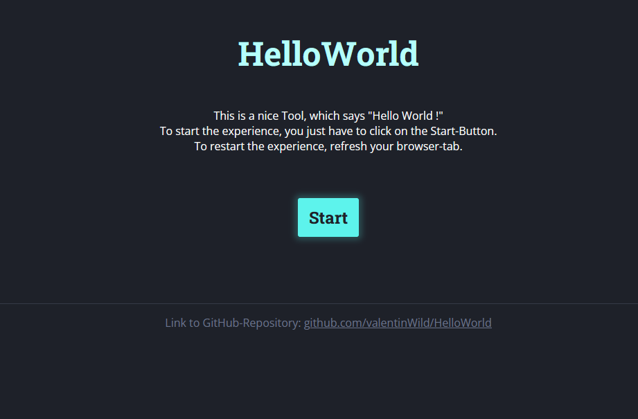
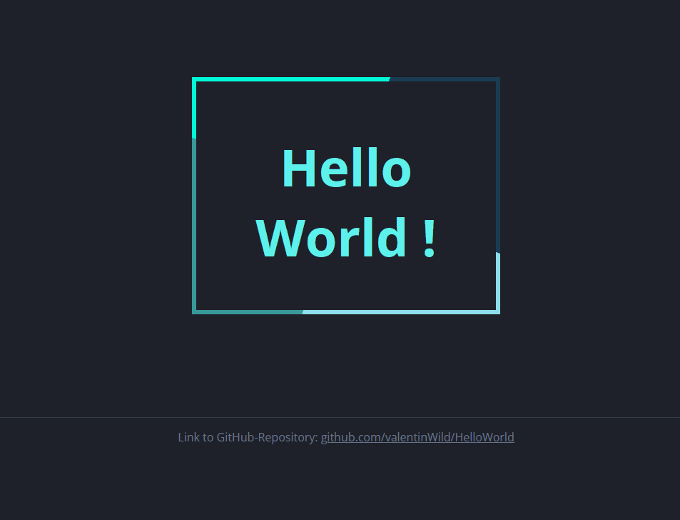

# HelloWorld

A simple Hello-World-Animation, that can be displayed in a Web-Browser.

## Usage

1. Open following link in a new tab of your Web-Browser: \
<https://htmlpreview.github.io/?https://github.com/valentinWild/HelloWorld/blob/main/index.html>

2. Click on the button "Start" to start the animation
3. To return to the start-page just refresh your browser-tab (e.g. by pressing Ctrl + R)

## Preview

 
*The Start Screen*

*The Animation Screen*

